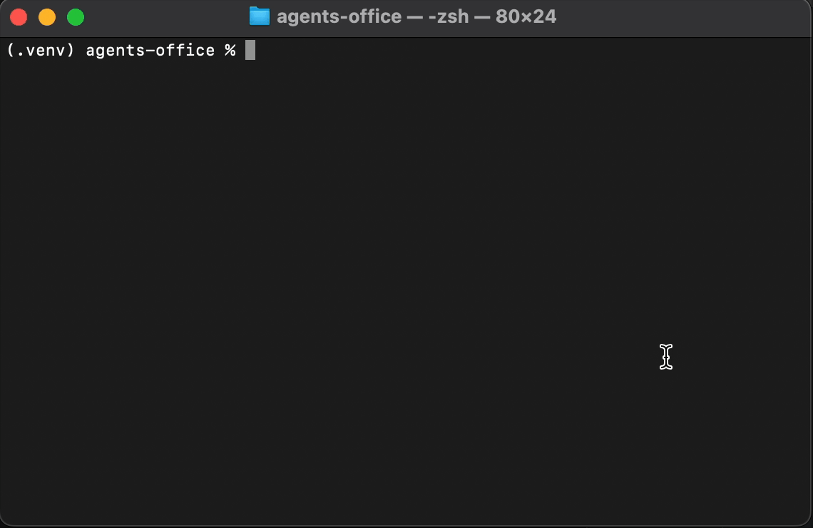

# Agents Office



## What this is

A headless multi-agent office engine, run from the terminal or from Claude over MCP. You plug a company into it as a folder of YAML files; it ships with one fictional company, a recruitment agency.

- **Multiple companies:** each company lives in `companies/<name>/` with its own departments, intake rules and workspace. `python office.py new-company <name>` starts a new one from a template.
- **The demo company has 4 departments:** Talent Marketing, Candidate Hub, Compliance, and Pay & Bill. Their agents write salary reports and job ads, screen resumes, check compliance documents, and run payroll and invoicing.
- **MCP server:** Claude Code or Claude Desktop can run the whole office from a conversation: check status, run cycles, call tools, and submit drafts.
- **Human approval gates:** job ads aren't published and invoices aren't released until a person approves them.
- **Audit log:** every task keeps its status history, all agent activity is appended to the company's `workspace/logs/activity.jsonl`, and every approval or rejection records who made it: the OS username from the CLI, or `claude-code (on human instruction)` from MCP.
- **Real vs. draft labels:** the dashboard marks each task as REAL (a tool wrote files), CLAUDE DRAFT (text waiting for human review), or NO OUTPUT. Nothing is faked.
- **Live office view:** `python office.py city` shows an isometric floor plan in your browser, with one room per department, a character at each agent's desk, and your approvals in the Manager's Office inbox tray.

All people, clients, resumes, documents, rates and timesheets in this repo are **fictional sample data**.

## Overview

A headless multi-agent system. Each company's departments and agents are defined in YAML,
state lives in plain files, Claude is the orchestrator (through the API or through MCP from Claude Code),
and a terminal dashboard shows what every agent is doing and whether its output is real.

No GUI. No database. Everything is a file you can open, diff, and put in git.

## Quick start

```bash
pip install pyyaml pypdf python-docx reportlab   # reportlab is optional (PDF invoices; markdown otherwise)
python office.py run          # intake the sample inbox, run every agent until idle, print the dashboard
python office.py approvals    # see what needs a human
python office.py approve T-XXXXXX --note "looks right"
python office.py dashboard --live
```

To turn on the Claude-powered agents (the Job Ad Writer, or `--llm` for all agents):

```bash
export ANTHROPIC_API_KEY=sk-ant-...
export OFFICE_MODEL=claude-sonnet-5-5     # optional
python office.py run
```

`python office.py reset` clears tasks, logs, approvals and outputs so you can run it fresh.
These commands use the default company, `recruitment-demo`, whose inbox ships with **sample data** (fictional people and clients).

## Companies

```
office.yaml                     default_company: recruitment-demo
companies/
  recruitment-demo/             the sample recruitment agency
    departments/*.yaml          its departments and agents
    intake.yaml                 which inbox files become which tasks
    workspace/                  inbox, reference data, and generated state (tasks, approvals, logs, outputs)
  my-shop/                      ...another company, same shape
```

Every command takes `--company <name>`, before or after the command (`python office.py --company my-shop run` or `python office.py run --company my-shop`). Without it, the CLI uses the `OFFICE_COMPANY` environment variable, then `default_company` in `office.yaml`. Companies never share state: each has its own tasks, approvals, logs and outputs.

```bash
python office.py companies                 # list companies; * marks the default
python office.py new-company my-shop       # create companies/my-shop/ from the starter template
python office.py --company my-shop run
```

A new company starts with one department (Operations) and one pipeline agent (Inbox Clerk) that turns any file dropped in `workspace/inbox/notes/` into an intake report, plus a README that explains how to grow it. It runs without an API key.

## How it works

```
inbox/ file lands ─► intake.yaml rule ─► task queued in tasks/<department>.json
                                              │
                         orchestrator: one task per department per cycle
                                              │
              agent runs: YAML pipeline (no LLM) or Claude tool-use loop
                                              │
            tools do the work ─► files in outputs/  ─► done
                                              └─► approval needed ─► approvals/<task>.json
                                                         human: office approve / reject
                                                         └─► on_approve action (publish / release)
```

| Department | Agent | Trigger | Real work it does | Human gate |
|---|---|---|---|---|
| Talent Marketing | Salary Reports | new job order | Pulls BLS national wage percentiles for the role, compares the client's offer, writes a report | none |
| Talent Marketing | Job Ad Writer | new job order | Claude reads the order and benchmark, writes the ad | **approve before publish** |
| Candidate Hub | Resume Screener | new resume in `inbox/resumes/<JOB_ID>/` | Parses .txt/.pdf/.docx, scores against must-haves and experience, updates the candidate tracker, hands shortlisted candidates to Compliance | none |
| Compliance | Compliance Checker | shortlist hand-off | Checks the candidate's document manifest against the job's required docs: missing, expired, expiring within 30 days, files actually present | none |
| Pay & Bill | Invoicing & Payroll | new timesheet CSV | Computes pay and bill with overtime, writes a payroll export and one PDF invoice per client, flags anomalies (>60 hrs, missing rates, margin under 15%) | **approve before release** |

## Real work vs. placeholder

Every task carries a `work_type` the dashboard shows:

- **REAL**: a tool ran and wrote files (CSV, PDF, report, tracker update). The task lists the file paths.
- **CLAUDE DRAFT**: Claude wrote text (an ad) that a human must review.
- **NO OUTPUT**: nothing was produced. Blocked and failed tasks say why, e.g. "needs Claude: set ANTHROPIC_API_KEY" or "could not reach BLS". The system never fills a gap with made-up output.

## Office view

```bash
python office.py city              # opens http://127.0.0.1:8765/ in your browser
python office.py view              # same thing
python office.py city --port 9000 --no-browser
```

A live isometric floor plan of the office, drawn on a canvas and served by a small local web server (Python standard library only, no extra packages, works offline).

- **One company per view:** `python office.py city --company my-shop` shows that company; run a second view on another port to watch two at once.
- **Rooms:** each department in the company's `departments/*.yaml` gets a room with its name on a sign by the door, and each agent gets a desk with a small character at it. Add or remove a department file and the floor updates within a couple of seconds, no reload needed.
- **The character shows the agent's state:** typing = working, hand raised = waiting on you, red warning sign = blocked or failed, paper stack on the desk = tasks queued, slouched = idle.
- **Manager's Office:** that's you. The inbox tray on your desk holds the pending approvals. Click it to list them with copyable `approve` and `reject` commands.
- **Hand-offs:** when one department creates a task for another (for example Candidate Hub sending a shortlisted candidate to Compliance), a document flies from desk to desk. New approvals fly to your inbox tray.
- **Click a desk** to see that agent's tasks, each with its status and its REAL / CLAUDE DRAFT / NO OUTPUT label.
- **Activity ticker:** the bar along the bottom scrolls through the most recent log lines.
- **Live data:** while the view is open, the server rewrites the company's `workspace/dashboard.json` every 2 seconds and the page re-reads it. Run `python office.py run --watch` in another terminal to watch agents work.

Drag to pan, scroll or pinch to zoom, and double-click to re-center. The server only listens on `127.0.0.1` and serves just the page and `dashboard.json`.

## Running it from Claude Code (MCP)

```bash
claude mcp add agents-office -- python /full/path/to/agents-office/mcp_server.py
```

Then in Claude Code: "show me the office status", "run a cycle", "what needs approval?".
Claude gets `office_status`, `office_run_cycle`, `office_add_task`, `office_call_tool`, `office_list_tools`,
`office_approvals`, `office_decide`, `office_requeue` (send an unfinished task back to be redone), and `office_submit_work` (lets Claude Code write a Claude-only task's draft itself, e.g. the job ad, and send it for approval without an API key). Requires `pip install mcp` (v1 or v2 both work).

Every tool takes an optional `company` argument (empty = the default company), and `office_companies` lists them, so one MCP server runs all your companies.

## Job order format

Each `must_have` / `nice_to_have` entry has two parts:

```yaml
must_have:
  - text: Active Massachusetts RN license          # shown in the job ad exactly as written
    keywords: [registered nurse, rn license, bsn]  # resume search terms, used only by the screener
```

`apply_to` holds the "how to apply" line the job ad uses word for word.

## Adding a department

1. Write the tools it needs in `officekit/tools/<name>.py` with the `@tool(...)` decorator and import the module in `officekit/tools/__init__.py`. Tools are shared by every company.
2. Add `companies/<company>/departments/<name>.yaml` with its agents: `tools`, an optional `pipeline` (runs without an API key), a `system` prompt (used when Claude drives), `approval: required|none`, and an optional `on_approve` action.
3. If it reacts to files, add a rule to the company's `intake.yaml`.
4. `python office.py --company <company> check` validates every agent against the tool registry.
5. The new department gets its own room in `python office.py city` automatically.

## Data sources and limits

These describe the recruitment demo; paths are under `companies/recruitment-demo/`.

- **Salary data** comes from the U.S. Bureau of Labor Statistics public API (national OEWS estimates), cached in `workspace/data/salary_cache.json`. Set `BLS_API_KEY` (free) for higher rate limits. Map new job titles to SOC codes in `workspace/data/soc_map.yaml`. Job boards like Seek and Indeed prohibit scraping in their terms, so they aren't used; add one in `officekit/tools/salary.py` if you get licensed API access.
- **Publishing and releasing** currently move approved files to `outputs/published/` and `outputs/released/`. Posting to a real job board, accounting system or email needs that service's API credentials; the hook points are `publish_job_ad` and `release_invoices` in `officekit/tools/office_tools.py`.
- **Resume screening** is keyword and experience based, using job-relevant criteria only. Treat it as a first pass, not a hiring decision; automated screening is regulated in some places (for example NYC Local Law 144), so check what applies before using it on real applicants.

## Layout

```
office.py              CLI (every command takes --company)
mcp_server.py          MCP server for Claude Code / Desktop
office.yaml            engine settings: default_company
companies/<name>/      one folder per company
  departments/*.yaml   departments, agents, pipelines, prompts, approval rules
  intake.yaml          file -> task rules
  workspace/
    inbox/             files dropped here become tasks
    data/              reference data the company's tools read
    tasks/ approvals/ logs/ outputs/   generated state (gitignored)
    dashboard.json / dashboard.md      latest snapshot for other tools to read
officekit/             engine: store, orchestrator, agent runner, Claude client, dashboard, tools/
  view.py, web/        `office.py city` / `view`: local server + isometric floor plan page
  templates/company/   starter company used by `office.py new-company`
```
